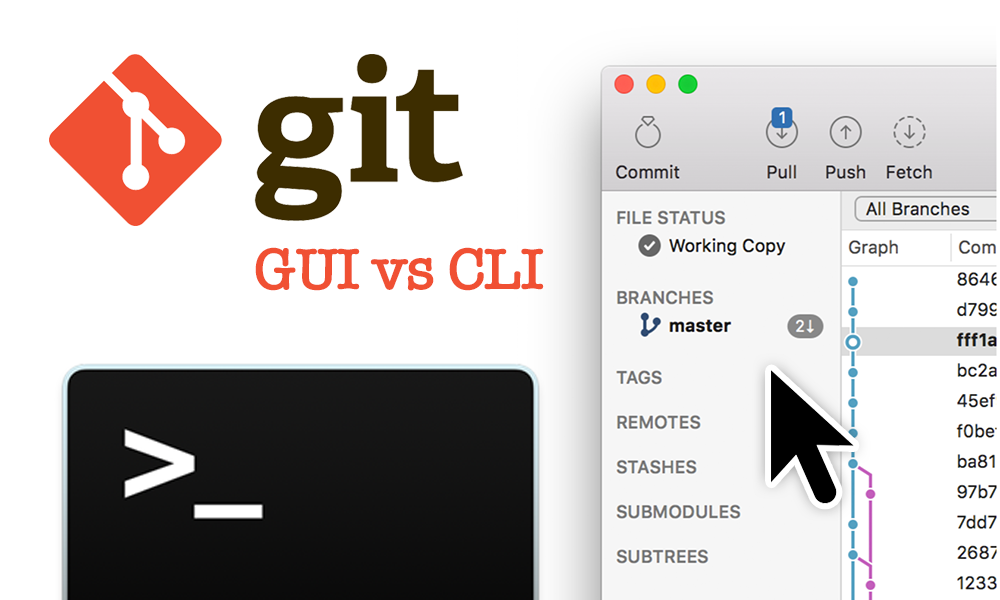

# Git workshop I
### by Olgierd'd "allgreed" Kasprowicz

<!--s-->

## Gui iz 4 n00bz


- Learning: <s>GUI</s> CLI
- Work: whatever does the shit

<!--v-->
## Git ain't Hub

<div style="display: grid; grid-template-columns: repeat(2, 1fr); grid-column-gap: 5%;">
<svg xmlns="http://www.w3.org/2000/svg" version="1.1" width="512" height="512">
    <path d="M 502.34111,278.80364 278.79809,502.34216 c -12.86794,12.87712 -33.74784,12.87712 -46.63305,0 l -46.4152,-46.42448 58.88028,-58.88364 c 13.68647,4.62092 29.3794,1.51948 40.28378,-9.38732 10.97012,-10.9748 14.04307,-26.80288 9.30465,-40.537 l 56.75401,-56.74844 c 13.73383,4.73404 29.56829,1.67384 40.53842,-9.31156 15.32297,-15.3188 15.32297,-40.15196 0,-55.48356 -15.3341,-15.3322 -40.16175,-15.3322 -55.50254,0 -11.52454,11.53592 -14.37572,28.47172 -8.53182,42.6722 l -52.93386,52.93048 0,-139.28512 c 3.73267,-1.84996 7.25863,-4.31392 10.37114,-7.41756 15.32295,-15.3216 15.32295,-40.15196 0,-55.49696 -15.32296,-15.3166 -40.16844,-15.3166 -55.48025,0 -15.32296,15.345 -15.32296,40.17536 0,55.49696 3.78727,3.78288 8.17299,6.64472 12.85234,8.5604 l 0,140.57336 c -4.67935,1.91568 -9.05448,4.75356 -12.85234,8.56264 -11.60533,11.60168 -14.39801,28.6378 -8.4449,42.89232 L 162.93981,433.11336 9.6557406,279.83948 c -12.8743209,-12.88768 -12.8743209,-33.768 0,-46.64456 L 233.20978,9.65592 c 12.87017,-12.87456 33.74338,-12.87456 46.63305,0 l 222.49828,222.50316 c 12.87852,12.87876 12.87852,33.76968 0,46.64456"
          style="fill:#f03c2e;stroke:none"/>
</svg>

</div>

<!--v-->
### Hubs are many
<div style="display: grid; grid-template-columns: repeat(3, 1fr); grid-column-gap: 5%;">


</div>

<!--s-->

## Before we begin

### GNU/Linux
```bash
git --version
```

### Mac
```bash
git --version
```

### Windows
```bash
# welcome travelers
# to your doom
git --version
```

<!--v-->

### Config (one time thing)

```bash
git config --global user.email [ your valid, existing email ]
git config --global user.name [ your name ]
# must in your PATH / aka executable from command line
git config --global core.editor [ your favourite editor command ]
```
<!-- .element style="width: 100%" -->

#### Example
```bash
git config --global user.email john@example.com
git config --global user.name John Smith 
git config --global core.editor vim
```
<!-- .element style="width: 100%" -->

<!--s-->
# Let's get rambling!!!

<!--s-->
## 0. This is my shell

Note:
There are many like it, but this one is mine. 
My shell is my best friend. It is my life. I must master it as I must master my life. 

<!--v-->
### This is *your* shell
```
# inside your .bashrc or whatever
# requires `bash-completion` package installed and imported

SHELL_SIGN='$'
GIT_PS1_SHOWDIRTYSTATE=1

set_bash_prompt() {
    git_info="$(__git_ps1)"
    cwd="\w"

    PS1="${cwd}${git_info} ${SHELL_SIGN} "
}

PROMPT_COMMAND=set_bash_prompt
```

See [allgreed/dotfiles](https://github.com/allgreed/dotfiles) for more

<!--v-->
### And *your* editor
```bash
# must in your PATH / aka executable from the command line
git config --global core.editor [ your favourite editor command ]
```
<!-- .element style="width: 100%" -->

<!--s-->
## 1. the 10% that does 90%
<!--v-->
### the hard part

```bash
mkdir just-testing
cd just-testing # or $_ if you like it fancy
# create 3 files: a, b, c that contains 'a', 'b', 'c' respectively

git init
git add --all
git commit -m "Initial commit"
# create repository on github OR hub create just-testing
```
<!-- .element style="width: 100%" -->
<!--v-->
### the tricky part
#### a.k.a. doing real work

```bash
# context: need to make 4 more a's (so that's 5 in total)
# and make the ALL CAPS
```

#### Hinty hint

```
mkdir backup
echo "backup" >> .gitignore
alias save='cp -rf .git backup/'
alias goback='rm -rf .git; mv -f backup/.git .; save; git checkout .'
```
<!-- .element style="width: 100%" -->

<!--v-->
```
echo "AAAAA" > a
git add --all
git commit -m "made changes"
```

https://whatthecommit.com/
<!-- .element class="fragment" -->
<!--v-->

```
echo "AAAAA" > a
git add --all
git commit -m "added 4 a's and capitalize them"
```
<!--v-->

```
echo "AAAAA" > a
git add a
git commit -m "added 4 a's and capitalize them"
```

<!--v-->

```
echo "AAAAA" > a
git add a
git commit -m "add 4 a's and capitalize them"
```
<!--v-->

```
echo "AAAAA" > a
git add a
git commit

# editor opens
Multiply and amplify the business message

We were thinking about getting 3 a's, but then John
argued that 4 a's are better because of our geopresence.
We settled for 5 a's after reviewing the impact of number
of a's on the architecture. Some tech lingo. Kubernetes.

Fixes #11
# close editor
```
<!-- .element style="width: 100%" -->

<!--v-->

```
echo "aaaaa" > a
...

echo "AAAAA" > a
...
```

<!--v-->

```
git branch fix-11
git checkout fix-11

echo "aaaaa" > a
...

echo "AAAAA" > a
...

git push -u origin fix-11
hub pull-request
git checkout master
```

<!--v-->

```
git checkout -b fix-11

echo "aaaaa" > a
...

echo "AAAAA" > a
...

git push -u origin fix-11
hub pull-request
git checkout master
```
<!--s-->

## 2. Oooops! Accidentaly commited to master :C

<!--v-->

```bash
git checkout master

echo "We're A!" > a
# do a proper commit

... ?
```

<!--v-->

```bash
git checkout -b my-branch
git checkout master
git reset --hard HEAD~
git checkout my-branch
```

- <span class="fragment">Dafuq is happening?</span>
- <span class="fragment">What does reset do?</span>
- <span class="fragment">Is hard necessary?</span>
- <span class="fragment">Loosing your HEAD?</span>
- <span class="fragment">Ok, but what is '~'?</span>

<!--v-->

```
G   H   I   J
 \ /     \ /
  D   E   F
   \  |  / \
    \ | /   |
     \|/    |
      B     C
       \   /
        \ /
         A
```
```
A =      = A^0
B = A^   = A^1     = A~1
C = A^2
D = A^^  = A^1^1   = A~2
E = B^2  = A^^2
F = B^3  = A^^3
G = A^^^ = A^1^1^1 = A~3
H = D^2  = B^^2    = A^^^2  = A~2^2
I = F^   = B^3^    = A^^3^
J = F^2  = B^3^2   = A^^3^2
```

<!--v-->

```
rm -rf backup
alias save=''
alias goback='git reset --hard HEAD~'
```

<!--s-->
- the usual - bla bla
- I go for 50% understanding, if you don't get it after we move on record who gets it

- Messy commits
- typo in commit message
- resolving merge conflicts

- if still time: how to take a push back?
- questions and problems
