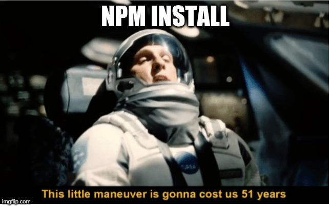
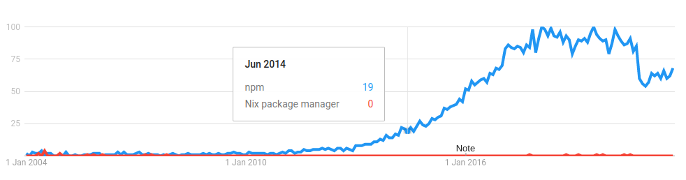

# How I Learned to Stop Worrying and Love Nix 
### by Olgierd'd "allgreed" Kasprowicz

<!--v-->

TODO: intro slide opinions / questions

<!--s-->

<!--v-->
## Let's talk packages



## The shiny new package manager
<!--v-->

### Not so new
- package managers in general: 90'
- Nix - 2004 (Eelco Dolstra paper)
- 1.0 in 2012
- User since 2019
<!--v-->

### Not so shiny

<!--v-->

### Not only package manager

- home-manager
- Nixos 
- Nixops
- Hydra
- Disnix
<!--s-->

## Quacks like a duck

<!--v-->

### Installation

```
curl -L https://nixos.org/nix/install | sh
```

<!--v-->


<!--v-->

```
https://releases.nixos.org/nix/nix-2.3.15/install
```

```
case "$(uname -s).$(uname -m)" in
    Linux.x86_64) system=x86_64-linux; hash=aae346f0ee447efa042c38e320aee0368e3c6c7fa331d76f708bbe8539f694fa;;
    Linux.i?86) system=i686-linux; hash=eee4d487ed4f370169e329ba88f1b1e7d8db3811bc24720ddb9c13a1a1f5c8ce;;
    Linux.aarch64) system=aarch64-linux; hash=cd0050cc1600b9911b9036f2a0c9b8c71fb22f4c7ef6916b3af60d2372b65515;;
    Darwin.x86_64) system=x86_64-darwin; hash=2042098eeb2ef0be8a30d1c8a39c4bcfba37041415bffd0de8ea1d75fdbd0615;;
    Darwin.arm64) system=aarch64-darwin; hash=91038ebf010d72b3d0ad7adf0aa5daf38b3ce843710396adfd5b34cf53e50aa1;;
```

```
if [ "$hash" != "$hash2" ]; then
    oops "SHA-256 hash mismatch in '$url'; expected $hash, got $hash2"
fi
```

<!--v-->
Step 1:
```
curl -L https://nixos.org/nix/install | sh
```

<!--v-->
Step 2:

That's it...

<!--v-->
```sh
source ~/.nix-profile/etc/profile.d/nix.sh
```

<!--v-->

- GNU/Linux
- MacOs (including the arm ones*) <!--*-->
- WSL* <!--*-->
<!--v-->

### Usage

```
~ >_ nix-env --query
gcc-wrapper-9.3.0
home-manager-path
```

```
nix-env --[i]nstall/--uninstall
```

```
-e == --uninstall
```

<!--v-->

## ???

- use alongside $package_manager on all your $OSes
- multiple, **orthogonal** "system" packages versions simultainously (package management [no longer NP-complete](https://research.swtch.com/version-sat#alternatives))
- can be rootless (with various degrees)

<!--v-->

## Bonus: ansible
https://github.com/allgreed/debian-config/blob/master/roles/common/tasks/nix.yml

<!--s-->
## Should I?

### BENEFITS - DRAWBACKS > SWITCH_COST + IRRATIONAL_FACTORS
<!--v-->

### Temporary packages
```
~ >_ snmpget
The program 'snmpget' is not in your PATH. You can make it available in an
ephemeral shell by typing:
  nix-shell -p net-snmp

~ 127 >_ nix-shell -p net-snmp
[if first time: some download log]

[λ] ~ >_ snmpget
No hostname specified.
USAGE: snmpget [OPTIONS] AGENT OID [OID]...

  Version:  5.9
  Web:      http://www.net-snmp.org/
  Email:    net-snmp-coders@lists.sourceforge.net

OPTIONS:
  -h, --help		display this help message
[ommited for brevity]

[λ] ~ 1 >_ exit

~ 1 >_ snmpget
The program 'snmpget' is not in your PATH. You can make it available in an
ephemeral shell by typing:
  nix-shell -p net-snmp
```

<!--v-->
### Btw. you should "switch" at this point
<!--v-->

### Development environments
- multiple versions + isolation
- yup, tested this with other people
- GCC problem on CCC

<!--v-->
#### Demo

```
hub clone allgreed/digitalocean-token-scoper
cd digitalocean-token-scoper 
make init

make run

make build
make container
```
<!--s-->

## Word of warrning


<!--v-->
### Hashes and derivations
<!--TODO kiedyś fancy obrazek-->

<!--v-->
### Nix language
```
let
    a = 5
    b = 3
in
c: a + b + c
```

<!--v-->
### Demo (default.nix)

<!--v-->

### Packaging
```js
pyeasyga = with pkgs.python38Packages; buildPythonPackage rec {
  pname = "pyeasyga";
  version = "0.3.1";

  src = fetchPypi{
    inherit version;
    inherit pname;
    sha256 = "049zm9lddzvv0001wyqxg38cbiqizzh5009rvxbp82v5bpz1vkhi";
  };

  # tests are not stateless - they make a HTTP call :c
  doCheck = false;

  buildInputs = [ six ];
};
```

<!--v-->

### Welp... binary vs source?
```nix
(dmenu.overrideAttrs (oldAttrs: rec {
  patches = [
    (fetchpatch {
      url = "https://tools.suckless.org/dmenu/patches/solarized/dmenu-solarized-light-5.0.diff";
      sha256 = "0dwzf8aj8lvfqggb1lb1ds0r021dppxayg9gkrvr3004pgc0zwnq";
    })
    (fetchpatch {
      url = "https://tools.suckless.org/dmenu/patches/xresources/dmenu-xresources-4.9.diff";
      sha256 = "0clczp17zwkxy1qhy0inqjplxpq4mgaf4vvfvn063hk733r4i7rn";
    })
    (fetchpatch {
      url = "https://tools.suckless.org/dmenu/patches/line-height/dmenu-lineheight-5.0.diff";
      sha256 = "16aqbyp3mg2cgnm8dysbdgcdhh3r6k2fsw1cxzrkka22hvi73paa";
    })
    (fetchpatch {
      url = "https://tools.suckless.org/dmenu/patches/fuzzymatch/dmenu-fuzzymatch-4.9.diff";
      sha256 = "000fkg4dcr2vrpd442f2v6ycmmxdml781ziblzx5rxvvyclsryfd";
    })
  ];
}))
```

<!--v-->
### Thinkpad-ec usecase

https://github.com/allgreed/thinkpad-ec/blob/master/default.nix

<!--v-->
### Home manager
```
  programs.firefox = {
    enable = true;
    extensions = with nur.repos.rycee.firefox-addons; [
      ublock-origin
      vimium
      ...
    ];
    profiles = {
      myprofile = {
        settings = {
          "browser.ctrltab.recentlyusedorder" = false;
          "signon.remembersignons" = false;
          ...
        };
      };
    };
  };
```

<!--s-->

## Nixos

<!--v-->

### Remember Ansible?

```yaml
- name: install urxvt - terminal emulator
  package: name=rxvt-unicode-256color state=latest
  notify:
    - reload XRDB
  become: yes

# handlers.yml

- name: reload XRDB
  command: xrdb ~/.Xresources
```

- who did that?

<!--v-->
### So...

- actually works
- actually congruent
- actually fast

<!--v-->
### ~demo
    
<!--v-->
```
NAME                    USED   AVAIL  REFER  MOUNTPOINT
└── rpool               113G   102G   24K    none
    ├── data            29.4G  102G   24K    none
    │   ├── home        21.0G  102G   18.1G  legacy
    │   └── root        8.47G  102G   7.42G  legacy
    ├── local           82.4G  102G   24K    none
    │   ├── nix         71.5G  102G   71.5G  legacy
    │   └── user-cache  11.0G  102G   11.0G  legacy
    └── reserved        1G     103G   24K    none
```

<!--v-->
### Problems (unresolved)
- Tensorflow (Pytorch werks)
- Nvidia Profiler GUI 
- getting Brother printer to work
<!--v-->

### Ideas
- Knowledge sharing
- Custom modules for things (like onboarding in a company)
- Self-documenting

<!--s-->

## Nixops

- basically Terraform + Ansible

<!--v-->
### ~demo

<!--s-->

## Topics not covered
- security updates distribution and complex stuff like that
- flakes and in-depth stuff (take nix-pills!)
- monads (monoids in the...)
- hydra (nix CI)
- disnix (like nix k8s? o.0)

<!--s-->

## Share, study, modify, improve!
### pytanka?
