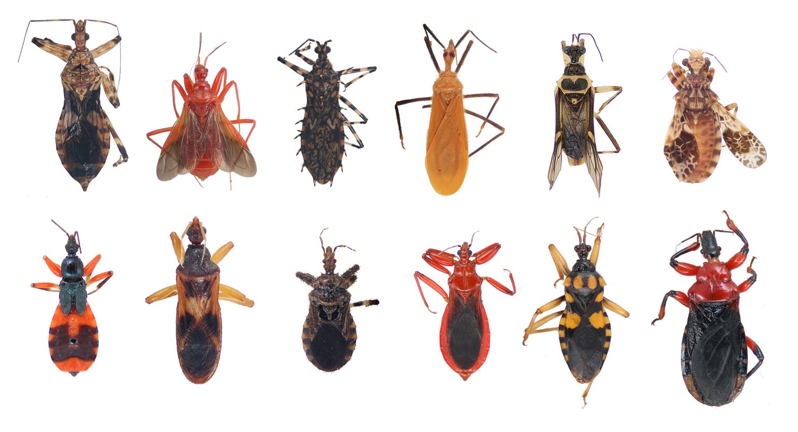

# Intro to Validation, QA and the Universe
### by Olgierd'd "allgreed" Kasprowicz
<!--v-->

## If we can turn back time...
<!-- pic of tardis -->

<!--v-->

## ...to the good old days
<!-- pic of old computers / people -->

<!--s-->

## Current state of affairs
<!-- pic of laptop, telephone and car -->
Note: 
- computer
- computer that can make calls
- computer that can drive
<!--v-->

## Disclaimer
I work at Intel, but I'm not representing Intel today. All opinions are my own.

<!--s-->

### The stack
http://chickencrap.com/media_images/2058.jpg
<!--v-->
### Abstraction leakage
<!-- TODO: quote about duck that needs bateries -->

<!--v-->
#### Example
```c
#include <stdlib.h>
#include <stdio.h>

int main()
{
    const int numbers[] = { 1, -5, -2147483648 };
    
    for (int i = 0; i < (sizeof numbers / sizeof (int)); ++i) {
        int num = numbers[i];
        printf("Raw value: %d\n", num);
        printf("Absolute value: %d\n", abs(num));
    }

}

```

TODO: fragment
```
Raw value: 1
Absolute value: 1
Raw value: -5
Absolute value: 5
Raw value: -2147483648
Absolute value: -2147483648
```

<!--v-->
#### Explanation
TODO

<!--v-->
#### Java good, si?
```
public class JavaGood
{
    public static void main(String []args)
    {
        System.out.println(Math.abs(Integer.MIN_VALUE));
    }
}
```
TODO: fragment
```
-2147483648 // Nope xD
```


<!--s-->

## Vilans


Note: bugs and defects
errors ~ bugs | defects

<!--v-->

### What is ...?
- Love <span class=fragment>-> baby, don't hurt me.</span> <span class="fragment">no more.</span>
- App <span class=fragment>-> collection of behaviours</span>
- Bug <span class=fragment>-> behaviour that is unexpected by the user</span>
- Defect <span class=fragment>-> deviation from the spec</span>

Note: bug might be a feature, and defect might not be bug

<!--s-->
### Let's talk quality


Note: bug detection at certain stages - which one is better?
Shit breaks == bug detected in production

<!--v-->

### Definition of crap


<!--v-->
### The ultimate fix


Note: this will work, 100%, right?

<!--v-->
### Law of diminishing returns


Note: Sheryl Sandberg - "Finished is better than perfect", Pareto rule

<!--v-->


Note: now - this is uber, oui?

<!--v-->
### What IBM did...

<div style="max-height: 180px; overflow: hidden;">

</div>

<small>[full study](ftp://ftp.software.ibm.com/software/rational/info/do-more/RAW14109USEN.pdf)</small>

Note: cost of rework, Mariner 1, 1962, $18.5 million - attributed to missing comma or extraneous semicolon

<!--v-->
### What do we trully desire :3


Note: this is too single-minded however

<!--v-->
### Bugs not created equal



Note: specs -> more fine grained => more potential for defects

<!--v-->

### What we'll get


Note: because bugs are added and effectively caught at different stages - you can sleep in advance!

<!--s-->
## The heros


Note: QA - increasing quality and making it cheaper
Testing - fighting bugs
Validation - fighting defects
I'll talk mostly about validation and a bit abount QA
<!--s-->

### Let the testers do the testing!


Note: before we begin - some groud rules for validation. Tester -> testing. You -> validation.

<!--v-->

### Manual validation? Nope.


Note: robots >> humans at certain tasks. Pick and place robot - 150 elements per minute with superb accuracy. Reduces regressions to minimum.
<!--v-->
 
### Why not validate?


<!--v-->
### The excuses

- <span class=fragment>time pressure</span><span class="fragment"> -> you'll have to get it right anyway</span>
- <span class=fragment>it's hard</span><span class="fragment"> -> **IT is hard**, deal with it</span>
- <span class=fragment>it's teadious</span><span class="fragment"> -> use better tools</span>
- <span class=fragment>your spirits are crushed</span><span class="fragment"> -> <a href="https://dzone.com/articles/why-wouldnt-you-write-unit-tests">this is real ^^</a></span>
- <span class=fragment>I don't know how!!!</span><span class="fragment"> -> that's a valid one :)</span>

Note: engeering -> responsibility + hard craft
<!--s-->
## So... how to validate?
<!--v-->

### The spec
- function that returns n-th number of Fibonacci sequence
<!--v-->

### The testing framework
```js
type TestFn = () => bool

tests: Array<TestFn> = [
    ...
]

for (const test of tests)
{
    if (! test())
    {
        process.exit(8)
    }
}
```

Note: console.log() is **not** a testing framework
<!--v-->

### The test
```js
function fib(n: number): number { ... }  // interface

const testFibbonachiFunction = () => {
    return fib(8) === 21
}

const tests = [ testFibbonachiFunction ]

for (const test of tests)
{
    if (! test())
    {
        process.exit(8)
    }
}
```
<!--v-->

### The code
```js
function fib(n) {
    if (n == 0) return 0
    if (n == 1) return 1

    return fib (n - 1) + fib (n - 2)
}
```
```
const testFibbonachiFunction = () => {
    return fib(8) === 21
}

const tests = [ testFibbonachiFunction ]

for (const test of tests)
{
    if (! test())
    {
        process.exit(8)
    }
}
```

<!--v-->
### Production grade - with Jest
```js
function fib(n) {
    if (n == 0) return 0
    if (n == 1) return 1

    return fib (n - 1) + fib (n - 2)
}

test("fib(n) returns n-th number of the fibbonachi sequence",
    () => {
        expect(fib(8)).toBe(21);
});
```

<!--v-->

### Refactor! Refactor all the things!
```js
const fib = n =>
  n < 2
  ? n
  : fib_matrix_power([1, 1, 0], n - 1)[0];

const fib_matrix_power = (matrix, n) =>
  matrix_times(...new Array(n).fill([1, 1, 0]));

const matrix_times = (...matrices) =>
    matrices.reduce(
        ([a,b,c], [d,e,f]) => [a*d + b*e, a*e + b*f, b*e + c*f]
    );
```

Note: Previous implementation was O(2^n), this is O(n) and can be O(log n)
Does it work?
Do you have to understand the code?
Nope! Just run the test suite

<!--s-->

## That was cute

```js
function processInvoice(clientID, amount)
{
    const dbClient = await DB.getClientbyID(clientID)
          
    await stripe.charge(dbClient.stripeAccount, amount)
        .catch(err => {
            console.error("Pay up!") 
        })

    const message = `Successful payment for ${}`
    await pushNotification.send(client.activeSessions, message)

    await sendEmail()
}
```
Note: the simple examples != production code
Because production code is rarely pure function

<!--v-->

### Let's monkey patch:
- database
- http request to Stripe
- console.log()
- email

# NOPE! <!-- TODO: red + slide -->

<!--v-->
### Test vs. testable code
> There cannot be good laws without good armies, and where there are good laws, there must be good arms, so I he will only discuss arms, not laws.
>
> ~ Niccolò Machiavelli

Note: Test -> testable code; Testable code -> tests; I'll talk about testable code

<!--v-->
### Dependency Injection

```js
function processInvoice(clientID, amount,
    DB = psqlConnection,
    stripe = stripeClient,
    console = console,
    pushNotification = socketIOManager,
    sendEmail = sendGridProviderController,
)
{
    ... // pure function now :D
}
```
<!--v-->

### Boundaries

- repositories
- reference the presentation about test boundaries
- TODO

<!--v-->
### Hexagonal architecture

- TODO

<!--s-->

## Technically

- what we just did === unit test
- unit test + setup === integration test
- integration test + more setup === E2E test
<!--v-->

### But...

<!--s-->

## Can we do better?
<!--v-->
### Of course - data-driven tests

```js
test("ein", () => {
    expect(fib(0)).toBe(0);
});

test("zwei", () => {
    expect(fib(1)).toBe(21);
});

test("drei", () => {
    expect(fib(8)).toBe(21);
});

test("zwei", () => {
    expect(fib(9)).toBe(34);
});
```
<!--v-->
```js
const each = require('jest-each').default;

...

each([
    [0, 0],
    [1, 1],
    [8, 21],
    [9, 34]
])
.test("fib(%d) == %d", (n, expected) => {
    expect(fib(n)).toBe(expected);
  }
);
```

