# Somsiedzie jak to się włancza?
### by Olgierd'd "allgreed" Kasprowicz

<!--v-->

## Disclousure

Note: pracuję w Dyna. Wszystkie opinie należą do ich właścicieli.

<!--v-->
## Source
### github.com/allgreed/presentations/$title


Note:
- slajdy są i będą dostępne teraz i potem
- pytania wyjątkowo poproszę po, bo jestem dzisiaj dosyć mocno timeboxowany
- wyjątkiem są pytania o komendy shellowe
- prezentacja wymaga znajomości **coreutils** na poziomie **podstawówki**, ale jak ktoś **zapomniał** to **mogę powtórzyć**
- (meetup językowo agnostyczny)

<!--s-->

## Historyjka
Note:
- historyjka nie jest z Dynatrace'u
- (jak w tym nowym filmie o Kalinie Jędrusik) historyjka nie musiała się wydarzyć, ale mogła
- pewnego dnia poszedłem sobie do pracki

<!--v-->

Note: O tutaj, widać stąd mój dom! I zacząłem dzień od...

<!--v-->

Note: Kawki

<!--v-->
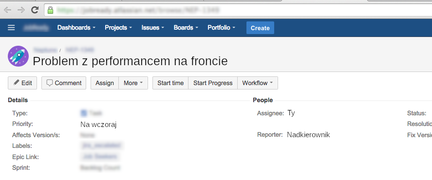

<!--v-->


<!--v-->
## czerwone jest szybsze

[PS to prawda](https://www.quora.com/Which-color-of-light-moves-fast-red-or-violet)
Note: czerwone jest szybsze, więc wystarczy pomalować front na czerwono

<!--v-->

Note: kim jest ten człowiek?

<!--v-->

```
git clone git.korpo-serwer.work/jakiśkomponent/frontend
```

<!--v-->


<!--TODO: colour gif-->

<!--v-->
```
cat README.md
```

<!--v-->
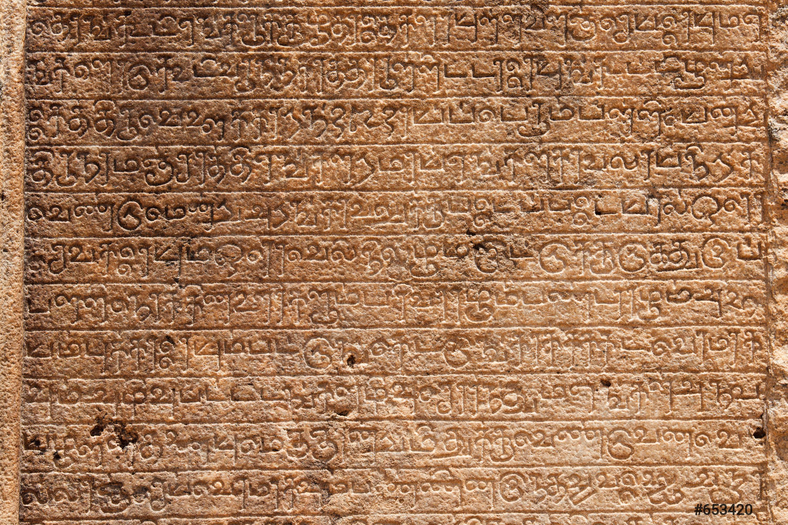
Note: niezbyt pomocne, nieczytelne i pewnie antyczne, to może zagadamy z autorem

<!--v-->
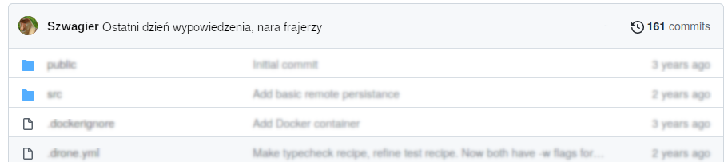
Note: szwagier dostał awans... na CTO Wallmarta. Żartuję, na klienta firmy.

<!--v-->
Intentionally left blank

<!--v-->
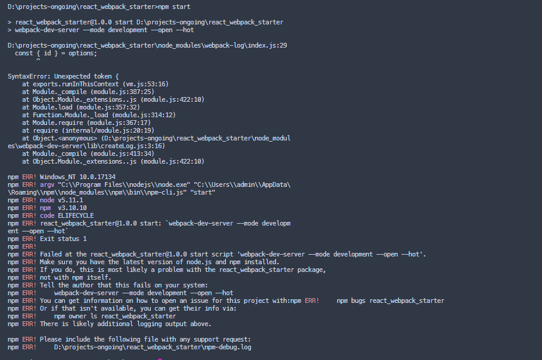

<!--v-->

Note:
- jakie kroki były konieczne? nie pamiętam
- co było zbędne? nie wiem
- jakie soft trzeba było zainstalować? nie zapisałem
- ile czasu to zajęło? za długo
- ale działa
<!--v-->


<!--v-->

Note: czas mija
<!--v-->

Note: junior pyta jak zestawić środowisko

<!--v-->

Note: w takich chwilach czuję się jakbym żył i umarł w San Andreas
<!--s-->


Note: ogólnie trochę cringe, że to tak wygląda
<!--v-->

czas zestawienia projektu * ilość osób

Note:
i zadziwiająco sporo osób ma problem ze stawianiem projektu:
- onboarding
- devops (jestem tu tylko na chwilę)
- open source
- techniczny P[roduct] M
- Ty z przyszłości, nowy laptop kto tam
:::
- czas cykli i opportunity cost
- zmiana paradygmatu, Unix, Smalltalk z Xerox PARC, dynamicznie przeładowywalny kod, wczesne Unixy
:::
- kalkulator - smutna buźka

<!--s-->

## Rozwiązanie?
Note:
- czy to jest problem programistyczny?
- zdania ekspertów są podzielone
<!--v-->


Note: programowanie o programowaniu -> metaprogramowanie
<!--v-->

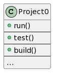
Note:
- projekt i sposoby interakcji
- czy to jest jeden projekt?
<!--v-->
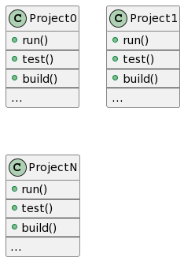
<!--v-->
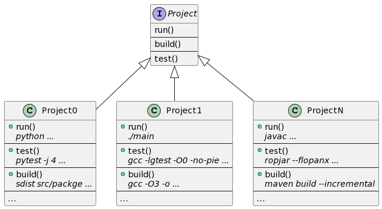
Note: 
- czy one mają coś wspólnego?
- jak możemy to opisać?
<!--v-->
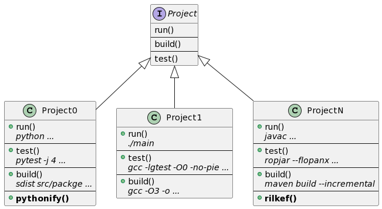
Note: okazuje się, że mają też bardzo specyficzne zachownaia
<!--v-->
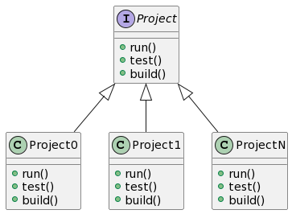
Note: ale nas to bajo-jajo

<!--v-->


<!--s-->
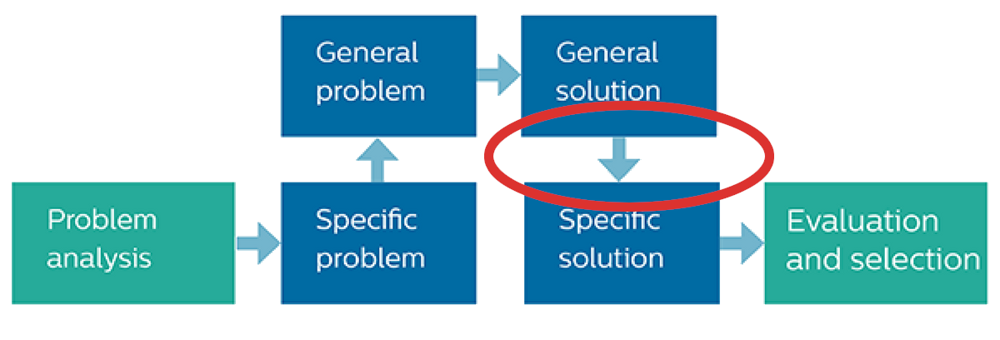
Note:
- a mówią, że Triza nie da się stosować w IT
- metodyka radziecka, nie rosyjska

<!--v-->
# Makefile

<!--v-->
```Makefile
# Makefile
.PHONY: ble
ble:
	echo aloha
	echo mordeczki

.PHONY: fuj
fuj:
	echo siemanejro
```

```sh
>_ make ble
echo aloha
aloha
echo mordeczki
mordeczki

>_ make fuj
echo siemanejro
siemanejro
```
Note:
- kto zna `make`a?
- taki multiskrypt shellowy
- zamiast echo może być dowolna komenda
<!--v-->

## Idea
```Makefile
.PHONY: run
run: setup
	# run commands here

.PHONY: build
build: setup
	# build commands here

.PHONY: test
test: setup
	# test commands here

...
```
Note:
- spójna warstwa między projektami, implementowalna w dowolny sposób
- językowo agnostyczny sposób odpalania skryptów projektowych (jak np npm scripts) 
- dam wam chwilę nacieszyć oczy

<!--s-->

## Make

Note: 
- późne lata 70, głównie używany do budowania projektów w C/Cpp
- (bo tylko to wtedy było)
- stabilny, efekt Lindy
- bardzo praktyczny, zacytować prof Johanna Briffę o X forwardingu
<!--v-->

## Dependnecies
```Makefile
# Makefile
.PHONY: build
build:
	@echo buduję

.PHONY: run
run: build
    @echo odpalam
    # '@' <- prefix, don't output command
```

```sh
>_ make run
buduję
odpalam
```

<!--v-->
## Files
```
# Makefile
.PHONY: run ble fuj
# targets run, ble and fuj are not files
run: a.txt
	@echo odpalam

a:
	@echo buduję plik A
	touch a.txt
```

```sh
>_ make run
buduję plik A
touch a.txt
odpalam
>_ make run
odpalam
```

Note:
- uważny obserwator, kolejność nie jest istotna
- również dyrektywa PHONY może być w dowolnym syntaktycznie poprawnym miejscu oraz zawierać dowloną ilość targetów
- kolejna inwokacja nie buduje A ponownie

<!--v-->

## Varaibles
```Makefile
# Makefile
.PHONY: ble fuj

CC := gcc
SIMPLE := zog
COMPLEX := --siema -x=$(SIMPLE)

ble:
	$(CC) a $(COMPLEX)
 
fuj:
	$(CC) b
```

```sh
>_ make ble
gcc a --siema -x=zog
# ... gcc output omitted
Note:
- substytucja (koncepcyjnie referencja do tego samego)
- kompozycja
```
<!--v-->

## Reflection
```Makefile
# Makefile
.PHONY: help run
run: ## run the app
    @echo odpalam

help: ## print this message
	@grep -E ... $(MAKEFILE_LIST) | awk ...
.DEFAULT_GOAL := help
```

```sh
>_ make run
odpalam
>_ make
run                            run the app
help                           print this message
```
<!--v-->

## Misc
```Makefile
COMPONENTS := cli graph ui
init: $(addsuffix _init, $(COMPONENTS))
	@echo initalizing

define component_init
.PHONY: $(1)
  $(1)_init:
	ls $(1)
endef

$(foreach c, \
	$(COMPONENTS), \
	$(eval \
		$(call component_init,$(c))))
```

```sh
# originally it was not `ls`, but you get the point
>_ make
ls cli
ls graph
ls ui
initalizing
```
Note:
- tak, nie ma 'PHONY' i dalej działa
- to był produkcyjny kod
- to, że można nie znaczy, że się powinno
- każdy dostatecznie zaawansowany projekt GNU zawiera implementację LISPa

<!--v-->
## Make?
Note:
- istnieje, może być coś inne w przyszłości
- stary, sprawdzony, wyspecyfikowany
- przydatny, sporo użytecznych funkcji, sporo dziwnych również :D

<!--s-->
## Example
### Digitalocean Token Scoper
https://github.com/allgreed/digitalocean-token-scoper

<!--v-->
```Makefile
PORT=8080
LINTFLAGS := -e -s
...

run: secrets setup ## run the app
	APP_PERMISSIONS_PATH=./example.yaml \
    APP_LOG_LEVEL=debug \
    APP_LOG_FORMAT=text \
    APP_PORT=$(PORT) \
    ... \
    go run -mod=readonly $(SOURCES)

lint: setup ## run static analysis
	gofmt $(LINTFLAGS) -w .
```
Note:
- od razu jest na bieżąco update'owany przykład użycia i dostępnych flag (use case dev opsa)
<!--v-->
```Makefile
CLIENT_SECRET=aaaa
secrets: secrets/users/joe/secret ...

...

secrets/users/joe/secret:
	mkdir -p secrets/users/joe
	echo "$(CLIENT_SECRET)" > $@

interact: ## helper process to run predefined inputs
	curl ... -H "Authorization: Bearer $(CLIENT_SECRET)" | jq
```
Note:
- specyficzne dla projektu pomoce developmentowe / demonstracyjne
<!--v-->
```Makefile
env-up: ## set up dev environment
	docker run -d --name $(CONTAINER_NAME) \
        --restart=unless-stopped \
        -p $(CONTAINER_PORT):80 \
        ealen/echo-server:0.5.0 \
        --enable:environment false --enable:host
	sleep 2
```
Note:
- obsługa podsystemów zależnych
<!--v-->
```Makefile
todo: ## list all TODOs in the project
	git grep -I --line-number TODO
```
Note:
- generyczne utilki również spoko
- tak, ten grep łapie sam siebie
- normalnie używam innej wersji, ale ona nie mieści się na slajdzie
<!--v--> 
```yaml
# .drone.yml
kind: pipeline
type: docker
...

steps:
- ...

- name: lint
   image: allgreed/nix:2.3.10
   commands:
   - nix-shell --quiet --run 'make lint-check'
```
Note:
- inny CI, nie robi :D to się banalnie wyklikuje
- jedno miejsce do update'owania
- dev i CI używa tego samego

<!--s-->
## What about ...?

- environment
- bootstrap paradox
- secret security
- context switching
- reactive development flow

<!--v-->
## Secret security
```Makefile
ACQUIRE_SECRET := cat secret

secure:
	echo $$($(ACQUIRE_SECRET))
```
```sh
>_ make
echo $(cat secret)
tajemnica
>_ echo $(cat secret)
tajemnica
```
Note:
- Make zawiera deflację, bo $$ to $
- sekret nie jest eksponowany w komendzie
- ale komendę można skopiować i coś w niej zmienić
<!--v-->
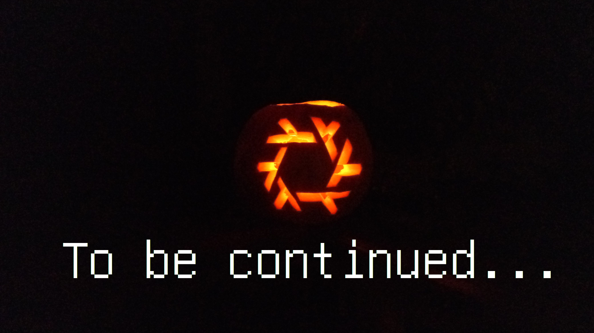

<!--s-->
## Call to action!
https://kasprowicz.pro/posts/common-makefile-interface/
- unlisted!

Note:
- use, study, share, improve <- więcej info w blogpoście

<!--v-->
## Questions?

Note:
- to jest QR kod do źródła ten z początku
